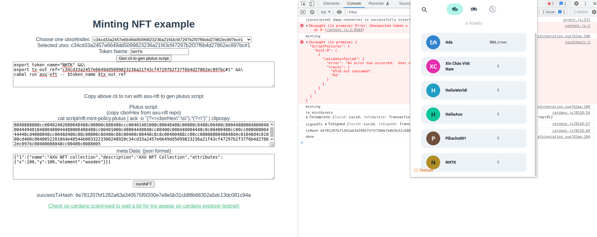

# Minting NFT sample



## Project setup
```
npm install
```

### Change your blockfrostAPIKey

In [./src/cardano.js](./src/cardano.js#L9)

```
const blockfrostAPIKey = 'put_your_key_here';
```

### Compiles and hot-reloads for development
```
npm run serve
```

### Relevant repo

You might need this repo for gernating plutus script

https://github.com/ahaxu/axu-nft
